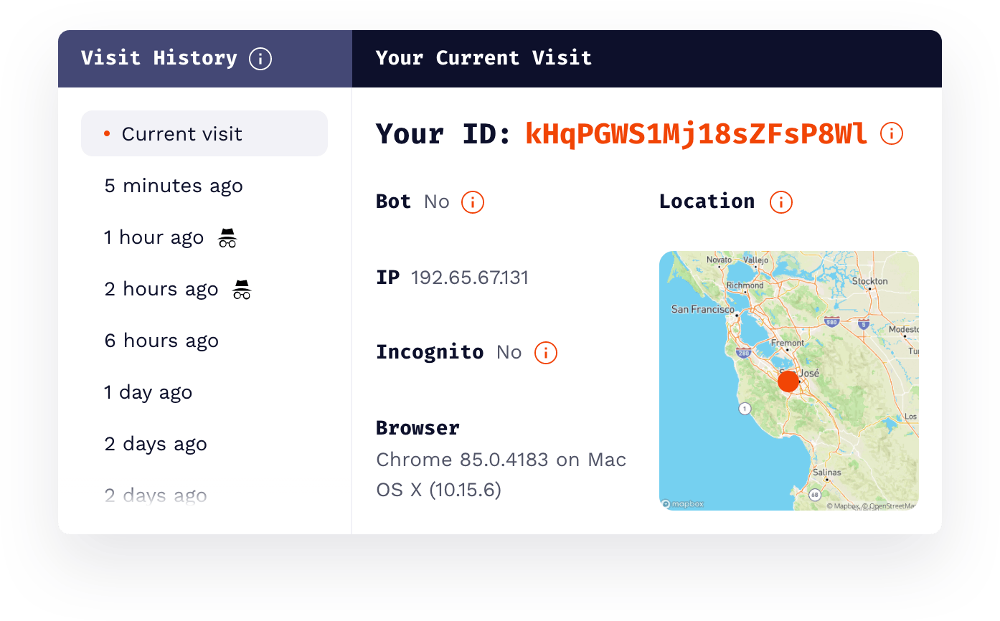

<p align="center">
  <a href="https://fingerprintjs.com">
    
  </a>
</p>
<p align="center">
  <a href="https://github.com/fingerprintjs/fingerprintjs/actions/workflows/test.yml">
    
  </a>
  <a href="https://www.npmjs.com/package/@fingerprintjs/fingerprintjs">
    
  </a>
  <a href="https://www.npmjs.com/package/@fingerprintjs/fingerprintjs">
    
  </a>
  <a href="https://www.jsdelivr.com/package/npm/@fingerprintjs/fingerprintjs">
    
  </a>
</p>

FingerprintJS is a browser fingerprinting library that queries browser attributes and computes a hashed visitor identifier from them. Unlike cookies and local storage, a fingerprint stays the same in incognito/private mode and even when browser data is purged.

[View Our Demo](https://fingerprintjs.github.io/fingerprintjs/).

## Quick start

### Install from CDN

```html
<script>
  function initFingerprintJS() {
    // Initialize an agent at application startup.
    const fpPromise = FingerprintJS.load()

    // Get the visitor identifier when you need it.
    fpPromise
      .then(fp => fp.get())
      .then(result => {
        // This is the visitor identifier:
        const visitorId = result.visitorId
        console.log(visitorId)
      })
  }
</script>
<script
  async
  src="//cdn.jsdelivr.net/npm/@fingerprintjs/fingerprintjs@3/dist/fp.min.js"
  onload="initFingerprintJS()"
></script>
```

[Run this code](https://stackblitz.com/edit/fpjs-3-cdn?file=index.html&devtoolsheight=100)

### Alternatively you can install from NPM to use with Webpack/Rollup/Browserify

```bash
npm i @fingerprintjs/fingerprintjs
# or
yarn add @fingerprintjs/fingerprintjs
```

```js
import FingerprintJS from '@fingerprintjs/fingerprintjs'

// Initialize an agent at application startup.
const fpPromise = FingerprintJS.load()

;(async () => {
  // Get the visitor identifier when you need it.
  const fp = await fpPromise
  const result = await fp.get()

  // This is the visitor identifier:
  const visitorId = result.visitorId
  console.log(visitorId)
})()
```

[Run this code](https://stackblitz.com/edit/fpjs-3-npm?file=index.js&devtoolsheight=100)

📕 [Full documentation](docs/api.md)

## Switch to [Pro version](https://fingerprintjs.com/github/) for free to get 99.5% identification accuracy

FingerprintJS Pro is a professional visitor identification service that processes all information server-side and transmits it securely to your servers using server-to-server APIs.
Pro combines browser fingerprinting with vast amounts of auxiliary data (IP addresses, time of visit patterns, URL changes and more) to be able to reliably deduplicate different users that have identical devices, resulting in 99.5% identification accuracy.

**You can use Pro FREE for up to 1,000 unique monthly visitors - no credit card required.**

<p align="center">
  <a href="https://fingerprintjs.com/github/">
    
  </a>
</p>

Full product comparison:

<table>
  <thead>
    <tr>
      <th></th>
      <th align="center">Open Source</th>
      <th align="center">Pro</th>
    </tr>
  </thead>
  <tbody>
    <tr><td colspan="3"><h4>Core Features</h4></td></tr>
    <tr><td>100% Open-source</td><td align="center">yes</td><td align="center">no*</td></tr>
    <tr><td><b>Standard fingerprint signals</b><br/><i>screen, os, device name</i></td><td align="center">✓</td><td align="center">✓</td></tr>
    <tr><td><b>Advanced fingerprint signals</b><br/><i>canvas, audio, fonts</i></td><td align="center">✓</td><td align="center">✓</td></tr>
    <tr><td><b>ID type</b></td><td align="center">fingerprint</td><td align="center">visitorID**</td></tr>
    <tr><td><b>ID lifetime</b></td><td align="center">several weeks</td><td align="center">months/years</td></tr>
    <tr><td><b>ID origin</b></td><td align="center">client</td><td align="center">server</td></tr>
    <tr><td><b>ID collisions</b></td><td align="center">common</td><td align="center">rare</td></tr>
    <!-- -->
    <tr><td colspan="3"><h4>Additional Features</h4></td></tr>
    <tr><td><b>Incognito mode detection</b><br/><i>works in all modern browsers - see our full list of <a href="https://dev.fingerprintjs.com/docs/browser-support/" target="_blank">browsers supported</a></i></td><td align="center">–</td><td align="center">✓</td></tr>
    <tr><td><b>Server-side accuracy increase</b><br/><i>based on additional server-side signals, such as TLS crypto support, ipv4/v6 data and others</i></td><td align="center">–</td><td align="center">✓</td></tr>
    <tr><td><b>Query API & realtime Webhooks</b><br/><i>build flexible workflows</i></td><td align="center">–</td><td align="center">✓</td></tr>
    <tr><td><b>Geolocation</b><br/><i>based on IP address</i></td><td align="center">–</td><td align="center">✓</td></tr>
    <!-- -->
    <tr><td colspan="3"><h4>Operations</h4></td></tr>
    <tr><td><b>Data security</b></td><td align="center">Your infrastructure</td><td align="center">Encrypted at rest</td></tr>
    <tr><td><b>Storage</b></td><td align="center">Your infrastructure</td><td align="center">Unlimited up to 1 yr</td></tr>
    <tr><td><b>Regions</b></td><td align="center">Your infrastructure</td><td align="center">Hosting in US and EU</td></tr>
    <tr><td><b>Compliance</b></td><td align="center">Your infrastructure</td><td align="center">GDPR, CCPA compliant***</td></tr>
    <tr><td><b>SLA</b></td><td align="center">No SLA</td><td align="center">99.9% Uptime</td></tr>
    <tr><td><b>Support</b></td><td align="center">GitHub community</td><td align="center">Support team via email, chat, and call-back within 1 business day</td></tr>
  </tbody>
</table>

<small>* Pro uses the open source fingerprinting library as well as proprietary technology for increased accuracy and stability.</small>

<small>** VisitorIDs, in comparison to fingerprints, include server side techniques, are deduplicated and utilize fuzzy matching to result in a more accurate and stable identifier. Fingerprint hashes rely on an exact match across all browser attributes, making them unstable across > 2 week time intervals.</small>

<small>*** FingerprintJS is GDPR and CCPA compliant as the data processor. You still need to be compliant as the data controller and use the identification for fraud under legitimate interest or ask for user consent.</small>

Pro result example:

```js
{
  "requestId": "HFMlljrzKEiZmhUNDx7Z",
  "visitorId": "kHqPGWS1Mj18sZFsP8Wl",
  "visitorFound": true,
  "incognito": false,
  "browserName": "Chrome",
  "browserVersion": "85.0.4183",
  "os": "Mac OS X",
  "osVersion": "10.15.6",
  "device": "Other",
  "ip": "192.65.67.131",
  "ipLocation": {
    "accuracyRadius": 100,
    "latitude": 37.409657,
    "longitude": -121.965467
    // ...
  }
}
```

🍿 [Live demo](https://fingerprintjs.com/demo)

⏱ [How to upgrade from Open Source to Pro in 30 seconds](https://dev.fingerprintjs.com/v3/docs/migrating-from-previous-versions#from-fingerprintjs-open-source-version-3)

📕 [FingerprintJS Pro documentation](https://dev.fingerprintjs.com)

▶️ [Video: use FingerprintJS Pro to prevent multiple signups](https://www.youtube.com/watch?v=jWX9P5_jZn8)

## Migrating from v2

- [Migration guide](docs/migrating_v2_v3.md)
- [V2 documentation](https://github.com/fingerprintjs/fingerprintjs/tree/v2)

## Version policy

See the visitor identifier compatibility policy in the [version policy guide](docs/browser_support.md).

## Browser support

The library supports all popular browsers.
See more details and learn how to run the library in old browsers in the [browser support guide](docs/browser_support.md).

## Contributing

See the [contributing guidelines](contributing.md) to learn how to start a playground, test and build.
